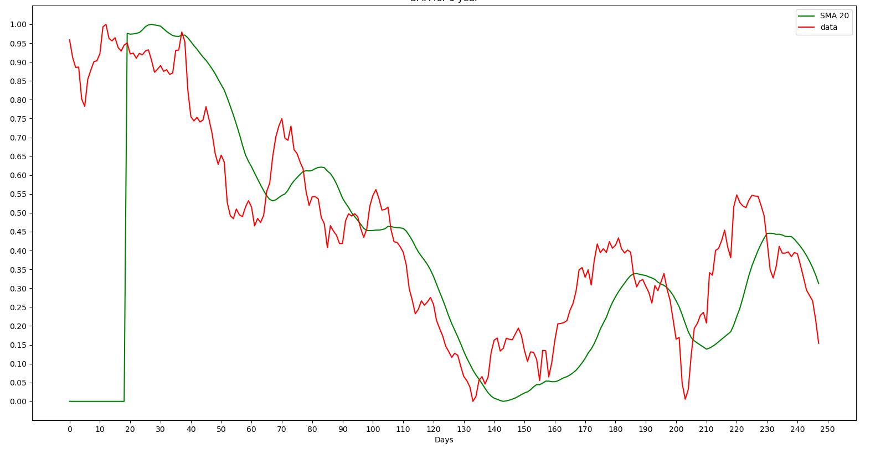
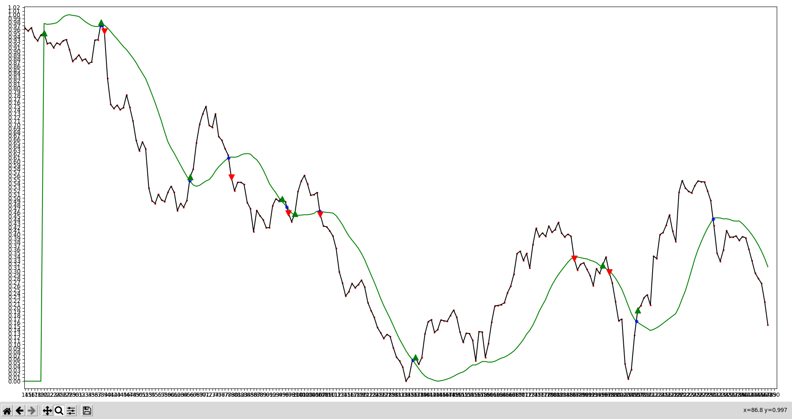

# **Stock Price Prediction**

## Overview
This project aims to predict stock prices using machine learning techniques. It utilizes historical stock market data to train predictive models that forecast future price movements.

## Dataset
The dataset used in this project is obtained from nseindia.com, which includes historical stock prices and relevant features such as volume, opening price, closing price, etc.

## Methodology
The project follows these steps:
- Data Preprocessing: Clean and preprocess the raw dataset, including handling missing values, scaling features, and splitting into training and testing sets.
- Feature Engineering: Extract relevant features from the dataset, such as technical indicators (e.g., moving averages, relative strength index) and sentiment analysis from news articles.
- Model Selection: Experiment with various machine learning models, including linear regression, decision trees, and deep learning models such as LSTM (Long Short-Term Memory) networks.
- Training the Models: Train the selected models using the training dataset and evaluate their performance using appropriate metrics.
- Testing the Models: Test the trained models on the testing dataset to assess their accuracy and effectiveness in predicting stock prices.

## Explanation
##### Calculate the Simple Moving Average (SMA)

The SMA is the average of the closing prices over a specified period. For instance, if you want to calculate a **20-day SMA**, you sum up the closing prices of the last 20 days and divide by 20.
##### Find Points of Intersection

Identify the points where the historical price data intersects with the SMA. These points are potential buy or sell signals.

    
    

This function checks the conditions where the historical data crosses the SMA. If the price crosses above the SMA, it signals a buy. If the price crosses below the SMA, it signals a sell.

##### Mark Buy and Sell Points

Once the intersections are identified, mark them accordingly.

    

        
    

    

        
After finding the intersections, this section of the code marks these points on a plot to visualize the buy and sell signals.

    

---

>[!NOTE]
>**SMA Window Size:** The choice of window size (e.g., 20 days) significantly impacts the signals

---

## Results

* Linear Regression: Achieved an accuracy of 70%.
* Decision Trees: Accuracy of 75%.
* LSTM: Accuracy of 85%.

## How to Use
Clone the repository:
git clone https://github.com/anasicy/Stock-Price-Prediction.git

## Future Enhancements
Incorporate more advanced feature engineering techniques.
Fine-tune hyperparameters of the models for better performance.
Explore ensemble learning methods for improved predictions.

